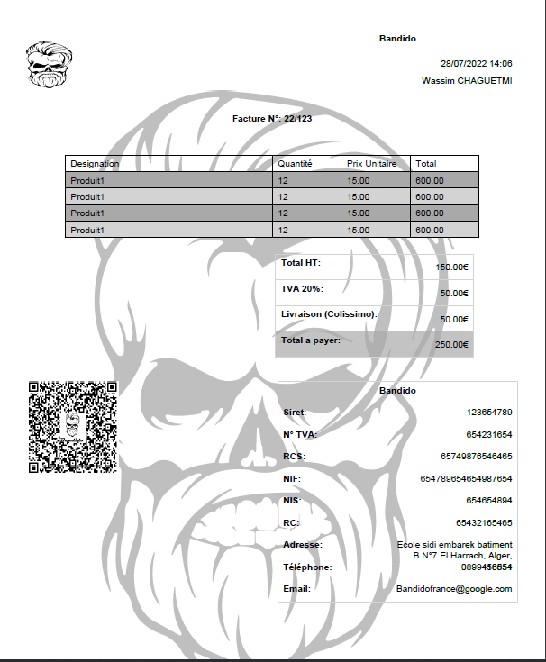

**pydf_invoice** is a utility class to help developers create PDF invoices using Python easily.

it relies on **reportlab** for creating the PDF document.

disclaimer: some features were inspired from py_invoice.

## Dependencies

* [reportlab](https://www.reportlab.com/)

## Installation

### PyPi

Install directly from PyPi.

```
$ pip install pydf_invoice
$ pip install reportlab==3.6.11
```

## How to Use

### example

this example can be found in the tests' folder.

```
file_path = "some_path/invoice.pdf"
client_info = ClientInfo(
    "Wassim CHAGUETMI",
    "0799136332",
    "Sidi Embarek El Harrach",
    "FR01256413564",
    "QSDAZ65465132",
    "SDQSDFQFSQ654981",
    "145875646123534213"
)

items = [
    Item("Produit1", "12", "15.00", "600.00"),
    Item("Produit1", "12", "15.00", "600.00"),
    Item("Produit1", "12", "15.00", "600.00"),
    Item("Produit1", "12", "15.00", "600.00"),
]

invoice_info = InvoiceInfo(
    "22/123",
    "28/07/2022 14:06",
    items,
    ["Designation", "Quantité", "Prix Unitaire", "Total"],
    "150.00",
    "50.00",
    "250.00",
    [colors.darkgrey, colors.lightgrey],
    "Colissimo",
    "50.00"
)

company_info = CompanyInfo(
    "Bandido",
    "Ecole sidi embarek batiment B N°7 El Harrach, Alger, 16051",
    "0899458554",
    "Bandidofrance@google.com",
    "123654789",
    "654231654",
    "654789654"
    "654987654",
    "654654894",
    "65432165465",
    "65749876546465",
    "assets/logo-blanc.png",
    "assets/qr_code.png",
)

invoice = PDFInvoice(
    file_path,
    client_info,
    invoice_info,
    company_info,
    "Test Title",
    watermark="assets/logo-blanc-not-transp.png"
)

invoice.create()
```

this will generate a PDF file at the specified `file_path` containing:



--------

# Documentation

## Model Classes

**ClientInfo**

Dataclass to hold invoice's client's information.

| Attribute | type              | Description                                                    |
|-----------|-------------------|----------------------------------------------------------------|
| name      | string            | Client's name                                                  |
| phone     | string (Optional) | Client's phone                                                 |
| address   | string (Optional) | Client's address                                               |
| tva       | string (Optional) | Client's tva (tax) must total decimal amount not percentage    |
| nif       | string (Optional) | Client's nif (Tax related information, used by some countries) |
| nis       | string (Optional) | Client's nis (Tax related information, used by some countries) |
| rc        | string (Optional) | Client's rc (Tax related information, used by some countries)  |

**BankAccount**

Dataclass to hold a bank account's information.

| Attribute    | type              | Description            |
|--------------|-------------------|------------------------|
| bank_name    | string            | Account's bank name    |
| rib          | string            | Account's rib          |
| bank_address | string (Optional) | Account's bank address |

**CompanyInfo**

Dataclass to hold your company's information. (the issuer of the invoice).

| Attribute    | type                                | Description                                                              |
|--------------|-------------------------------------|--------------------------------------------------------------------------|
| name         | string                              | Company's name                                                           |
| phone        | list[string]                        | Company's phones                                                         |
| address      | string                              | Company's address                                                        |
| email        | string                              | Company's email                                                          |
| tva          | string (Optional)                   | Company's tva (tax) must total decimal amount not percentage             |
| nif          | string (Optional)                   | Company's nif (Tax related information, used by some countries)          |
| siret        | string (Optional)                   | Company's siret (Tax related information, used by some countries)        |
| nis          | string (Optional)                   | Company's nis (Tax related information, used by some countries)          |
| rc           | string (Optional)                   | Company's rc (Tax related information, used by some countries)           |
| rcs          | string (Optional)                   | Company's rcs (Tax related information, used by some countries)          |
| logo         | Union[string , BytesIO]  (Optional) | Company's logo (must have a white background, avoid transparent PNGs)    |
| qr_code      | Union[string ,BytesIO] (Optional)   | Company's qr_code (must have a white background, avoid transparent PNGs) |
| bank_account | BankAccount (Optional)              | Company's bank account information                                       |

**Item**

Dataclass to hold your invoice's item information. (Product/Item/Merchandise...etc)

| Attribute  | type              | Description                                                     |
|------------|-------------------|-----------------------------------------------------------------|
| name       | string            | Item name (Designation)                                         |
| quantity   | string            | _                                                               |
| unit_price | string            | Unit's price preferably decimal format                          |
| total      | string            | Item's total (quantity * unit_price), preferably decimal format |

**InvoiceInfo**

Dataclass to hold your invoice's information

| Attribute        | type              | Description                                                                                                                                                                                                                 |
|------------------|-------------------|-----------------------------------------------------------------------------------------------------------------------------------------------------------------------------------------------------------------------------|
| number           | string            | Invoice's number (usually follows the format of 'YY/Serial').                                                                                                                                                               |
| date             | string            | Invoice's date (DD/MM/YYYY HH:MM).                                                                                                                                                                                          |
| data             | list[Item]        | Invoice's data (client's purchase).                                                                                                                                                                                         |
| table_cols       | list[string]      | Invoice's data table columns' names. ex: ['name','Qte','P.U','Total']                                                                                                                                                       |
| total_ht         | string            | Invoice's total without taxes, preferably decimal format.                                                                                                                                                                   |
| total_tva        | string            | Invoice's taxes amount, preferably decimal format.                                                                                                                                                                          |
| total_ttc        | string            | Invoice's total with taxes, preferably decimal format, this should be equal to (total_ht+total_tva)                                                                                                                         |
| rows_colors      | list[] (Optional) | A list of color that would be used cyclically for the data table rows, can be either hex strings or <br/> reportlab.lib.colors.Color. it's recommended to reduces the colors alpha, in order to keep the watermark visible. |
| delivery_company | string            | Delivery company name.                                                                                                                                                                                                      |
| delivery_cost    | string            | Delivery cost.                                                                                                                                                                                                              |

## Utility class

**PDFInvoice**

Utility class to hold different invoice data and build the PDF file.

| Attribute    | type                            | Description                                                                                                                                                                                                                           |
|--------------|---------------------------------|---------------------------------------------------------------------------------------------------------------------------------------------------------------------------------------------------------------------------------------|
| filename     | Union[string,BytesIO]           | Where to store the generated PDF file.                                                                                                                                                                                                |
| client_info  | ClientInfo                      | _                                                                                                                                                                                                                                     |
| invoice_info | InvoiceInfo                     | _                                                                                                                                                                                                                                     |
| company_info | CompanyInfo                     | _                                                                                                                                                                                                                                     |
| title        | str (Optional)                  | File meta data title.                                                                                                                                                                                                                 |
| text_style   | dict[ParagraphStyle] (Optional) | Text styles to be used for different texts in the invoice.<br/> the dict should contain 6 entries with these Keys ["right_body_text","left_body_text","center_body_text","right_header_text","left_header_text","center_header_text"] |
| watermark    | Union[str,BytesIO] (Optional)   | A watermark to be displayed in the background of the document's pages, should have a white background (avoid transparent PNGs).                                                                                                       |

this utility class is still under heavy development, so many changes will come, and it will be much more customizable.
if you need to change anything, add/remove, you can easily extend the `PDFInvoice` class and change the behaviour of the methods as you please, make sure to have the minimum knowledge of how reportlab works (story, flowable... etc).

### Example
You need to change the invoice title.

```
class AnotherTitleInvoice(PDFInvoice):
    # override the add_title method
    def add_title(self):
        title = Paragraph(f'Another Title: {self.invoice_info.number}', style=self._text_styles[CENTER_HEADER_TEXT])
        self.story.append(title) # all elements should be added the global document story.
        self.add_space(height= inch / 4) # always add a space after you add an element, each element is responsible for the space after it not before it.
```

Now you can just initialize your new class and call the `.create()` method to generate the PDF file.
# Licence

MIT
